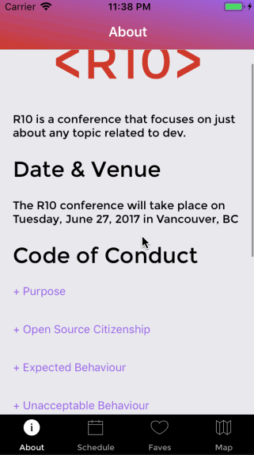
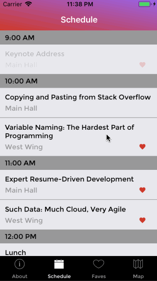

# R10

R10 is built using react-native to create a cross platform app for a developer conference. It features a responsive About/Code of Conduct screen, a full schedule list grouped by time with the ability to favourite a session and see it in a seperate favourites area, as well as a (soon to be built) map to view the venue.

About:

Schedule:

## Features

- Used React Native to build cross-platform functionality, and utilizes the Platform module to account for the differences in iOS and Android.
- Used Apollo Client and GraphQL to fetch the session data.
- Used Realm as a database to store favourites data. 
- Used the Animate module built in react nature for animations on the About screen.
- Used Redux for state management for favourites.

## Installation & Set Up

`$ npm install`

For iOS: (simulator is optional)
`$ react-native run-ios --simulator="iPhone SE"`

For Android:
`$ react-native run-android`